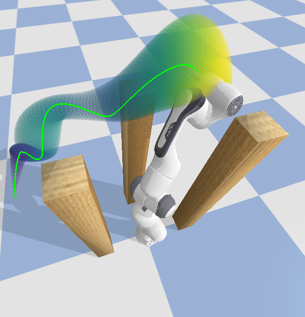

# Pybullet Path Visualizer
This is a simple plotting utility for cartesian paths in pybullet.
- Plots individual waypoints (x,y,z) using a shape model (i.e., torus) with alpha < 1.0 for transparency.
- Each waypoint object can be XYZ scaled and rotated.

